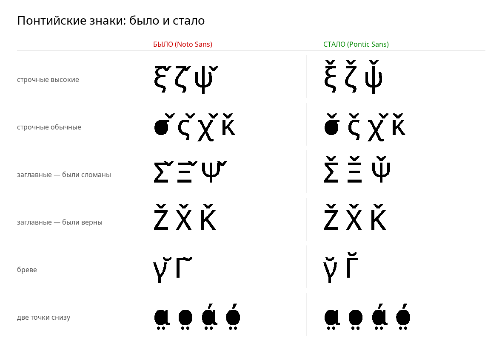

# Pontic Sans — шрифт для понтийских греческих знаков



## Зачем нужен

носитель языка сообщил с телефона:

> «Гачек хорошо сидит только над **Ζ** и **Χ**. Над **Σ**, **Ξ** и **Ψ** гачек
> сидит очень низко и его почти не видно. Также над **ξ** и **ζ**.»

Проверка подтвердила это численно и объяснила, почему именно Ζ и Χ вели себя
правильно.

## Причина

В шрифтах позиция комбинируемого знака над буквой задаётся **якорем**
(mark-attachment anchor) в таблице GPOS. Если якорь есть — знак садится точно
над буквой. Если якоря нет — знак ставится в позицию по умолчанию и налезает
на букву.

В Noto Sans якоря для гачека (U+030C) прописаны **только у части** греческих
букв:

| | Буквы |
|---|---|
| Якорь **был** | Α Χ Κ Ο Ζ α χ κ ο |
| Якоря **не было** | ξ ζ ψ σ ς γ **Σ Ξ Ψ Γ** |

Именно поэтому Ζ и Χ выглядели правильно — они попали в первый список.
Все буквы из второго списка отображались неверно. Совпадение с жалобой полное.

## Что сделано

Скрипт `build_font.py` добавляет 10 недостающих якорей: для каждой буквы точка
крепления ставится по её горизонтальному центру на высоте верхней границы.

| Буква | Якорь (x, y) | Почему такая высота |
|---|---|---|
| ξ ζ ψ | (256/256/380, **760**) | высокие строчные, их верх = 760 |
| σ ς γ | (318/254/243, **536**) | обычные строчные, x-height = 536 |
| Σ Ξ Ψ Γ | (286/312/410/286, **714**) | заглавные, cap-height = 714 |

## Проверка результата

`verify.py` прогоняет сочетания через настоящий движок раскладки текста
(HarfBuzz) — тот же, что используется в Android:

```
сочетание            было    стало   результат
ζ + гачек               0      224   ИСПРАВЛЕНО
ξ + гачек               0      224   ИСПРАВЛЕНО
ψ + гачек               0      224   ИСПРАВЛЕНО
Ξ + гачек               0      178   ИСПРАВЛЕНО
Ψ + гачек               0      178   ИСПРАВЛЕНО
Σ + гачек               0      178   ИСПРАВЛЕНО
Γ + бреве               0      178   ИСПРАВЛЕНО
Ζ + гачек             178      178   и раньше было верно
Χ + гачек             178      178   и раньше было верно
...
Исправлено сочетаний: 7, было корректно изначально: 10
```

Важно: у сочетаний, которые работали и раньше (Ζ, Χ, Κ, α, ο), значения
**не изменились** — правка ничего не сломала.

## Где применяется

Шрифт встроен в пакет `pontic_greek.kmp` как `DisplayFont` и `OSKFont`.
Это значит, что **на клавишах клавиатуры и в поле ввода Keyman** гачек
отображается правильно.

**Ограничение, о котором нужно знать честно:** текст в чужих приложениях
(WhatsApp, Telegram, заметки) рисуется их собственным шрифтом — повлиять на
это со стороны клавиатуры нельзя ни при каком решении. Чтобы понтийские
знаки везде выглядели правильно, шрифт нужно установить в саму систему.

## Сборка

```bash
python3 font/build_font.py   # собрать шрифт
python3 font/verify.py       # проверить через HarfBuzz
python3 font/sample.py       # картинка «до/после»
```

Требуется: `fonttools`, `uharfbuzz`, `pillow`.

## Лицензия

Основан на **Noto Sans** © Google (SIL Open Font License 1.1) — см. `OFL.txt`.
Лицензия OFL прямо разрешает изменение и распространение производных шрифтов.
