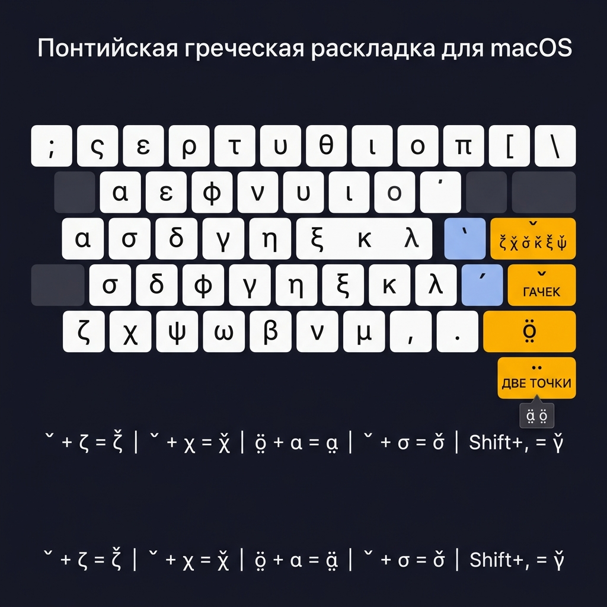

# Понтийская Греческая Раскладка — Инструкция для macOS

> **Версия:** 1.0 (альфа-тест)  
> **Платформа:** macOS (Ventura 13+ / Sonoma 14+)  
> **Файл раскладки:** `pnt-macos.keylayout`

---

## Что это такое

Это клавиатурная раскладка для понтийского греческого языка на macOS.  
Она **идентична стандартной греческой раскладке** — за исключением двух клавиш:

- Клавиша `'` (апостроф) → мёртвая клавиша **гачек `ˇ`**
- Клавиша `/` (слэш) → мёртвая клавиша **две точки снизу `̤`**

Вы можете использовать её вместо обычной греческой. Одна наклейка на ноутбук — и всё.

---

## Установка

### Шаг 1 — Скопируйте файл раскладки

**Вариант А — автоматически (рекомендуется):**

```bash
cd /путь/к/папке/pontic
bash install_macos.sh
```

**Вариант Б — вручную:**

Скопируйте файл `pnt-macos.keylayout` в папку:

```
~/Library/Keyboard Layouts/
```

*(В Finder: Меню Go → Go to Folder → вставьте путь выше)*

---

### Шаг 2 — Добавьте раскладку в систему

1. Откройте **Системные настройки → Клавиатура → Источники ввода**
2. Нажмите кнопку **`+`** (внизу слева)
3. В левой колонке выберите **"Другой" (Other)**
4. В списке найдите **Pontic Greek**
5. Нажмите **Добавить**

> **Важно:** Если раскладка не появляется в списке — перезайдите в Системные настройки или перезапустите компьютер.

---

### Шаг 3 — Переключение раскладок

| Способ | Действие |
|--------|----------|
| Клавиши | `Cmd + Space` (или то, что настроено у вас) |
| Мышь | Клик на флаге/значке в строке меню (правый верхний угол) |

---

## Схема раскладки



---

## Базовая раскладка (как греческая)

```
Обычный слой:
  ; ς ε ρ τ υ θ ι ο π [ ] \
  α σ δ φ γ η ξ κ λ ΄ ˇ
  ζ χ ψ ω β ν μ , . ̤

Shift:
  : ΅ Ε Ρ Τ Υ Θ Ι Ο Π \ / |
  Α Σ Δ Φ Γ Η Ξ Κ Λ ΄ ˇ
  Ζ Χ Ψ Ω Β Ν Μ ˘ ¨ ̤
```

---

## Понтийские символы — как набирать

### 🔸 Гачек `ˇ` (клавиша `'`, физически — апостроф)

Нажмите `'`, затем нужную букву:

| Нажатие | Результат | Описание |
|---------|-----------|----------|
| `'` → `ζ` | **ζ̌** | зета с гачеком |
| `'` → `χ` | **χ̌** | хи с гачеком |
| `'` → `σ` | **σ̌** | сигма с гачеком |
| `'` → `κ` | **κ̌** | каппа с гачеком |
| `'` → `ξ` | **ξ̌** | кси с гачеком |
| `'` → `ψ` | **ψ̌** | пси с гачеком |
| Shift+`'` → Shift+`ζ` | **Ζ̌** | то же в верхнем регистре |

> Если после `'` нажать пробел — выводится сам символ `ˇ`.

---

### 🔸 Две точки снизу `̤` (клавиша `/`, физически — слэш)

Нажмите `/`, затем нужную букву:

| Нажатие | Результат | Описание |
|---------|-----------|----------|
| `/` → `α` | **α̤** | альфа с двумя точками снизу |
| `/` → `ο` | **ο̤** | омикрон с двумя точками снизу |
| `/` → `Α` (Shift+α) | **Α̤** | то же в верхнем регистре |
| `/` → `Ο` (Shift+ο) | **Ο̤** | то же в верхнем регистре |

> Если после `/` нажать пробел — выводится сам символ `̤`.

---

### 🔸 Бреве `˘` (Shift + `,`)

| Нажатие | Результат | Описание |
|---------|-----------|----------|
| Shift+`,` → `γ` | **γ̆** | гамма с бреве |
| Shift+`,` → `Γ` | **Γ̆** | гамма с бреве (верхний регистр) |

---

### 🔸 Тонос `΄` (клавиша `;` — стандартный греческий)

Работает как в обычной греческой раскладке:

| Нажатие | Результат |
|---------|-----------|
| `;` → `α` | **ά** |
| `;` → `ε` | **έ** |
| `;` → `η` | **ή** |
| `;` → `ι` | **ί** |
| `;` → `ο` | **ό** |
| `;` → `υ` | **ύ** |
| `;` → `ω` | **ώ** |

---

## Краткая шпаргалка

```
ГАЧЕК:        '  +  буква
  ζ̌  χ̌  σ̌  κ̌  ξ̌  ψ̌

ДВЕ ТОЧКИ:   /  +  буква
  α̤  ο̤

БРЕВЕ:        Shift+,  +  буква
  γ̆

ТОНОС:        ;  +  буква (стандартный греческий)
  ά  έ  ή  ί  ό  ύ  ώ
```

---

## Option (Alt) слой

| Клавиша | Символ |
|---------|--------|
| Option + `ε` | € (евро) |
| Option + `α` | … |
| Option + `ι` | " |
| Option + `ο` | „ |
| Option + `,` | « |
| Option + `.` | » |
| Option + Space | неразрывный пробел |

---

## Если что-то не работает

**Раскладка не появляется в списке при добавлении:**
- Проверьте, что файл лежит в `~/Library/Keyboard Layouts/` (не в системной `/Library/`)
- Выйдите из Системных настроек и откройте снова
- В крайнем случае — перезагрузите Mac

**Символы с гачеком отображаются неправильно:**
- Это зависит от шрифта. В Unicode символы правильные — просто некоторые шрифты плохо рендерят комбинируемые диакритики. Попробуйте Noto Serif или Linux Libertine.

**Клавиша `/` не работает как мёртвая:**
- Убедитесь, что выбрана именно раскладка "Pontic Greek", а не обычная греческая.

---

## Что дальше

После успешного теста на macOS — планируем:

- [ ] iOS / iPadOS версия (файлы YAML уже готовы)
- [ ] Физическая наклейка на клавишу `'`
- [ ] Версия для Windows (`.klc` формат)

---

*Версия 1.0 · Альфа-тест · Июнь 2026*
